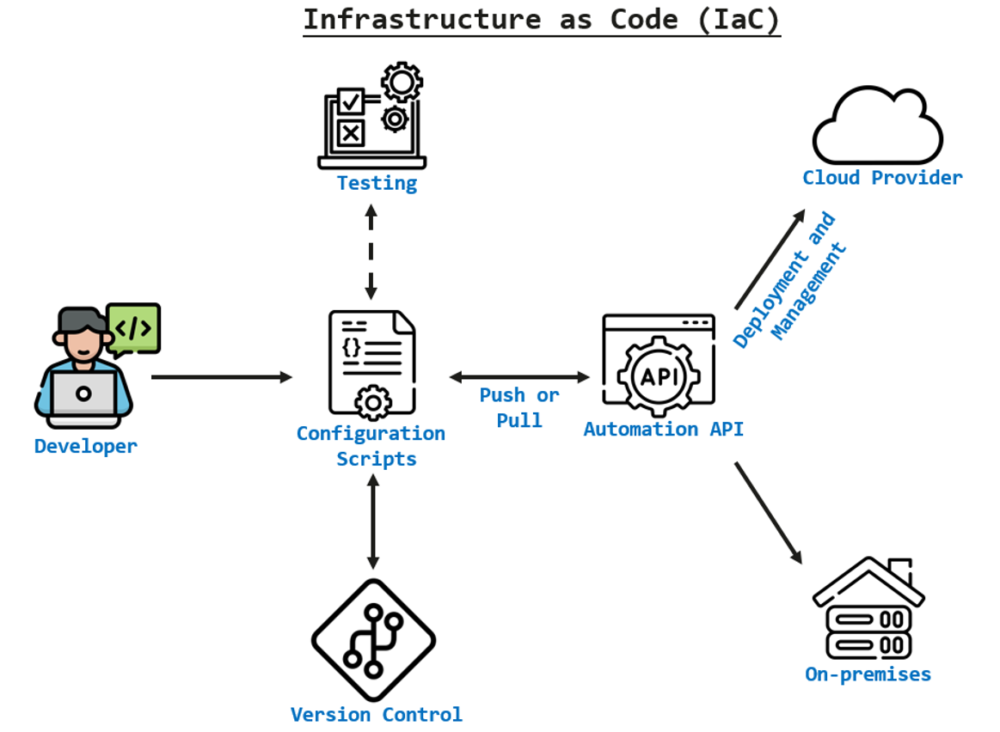
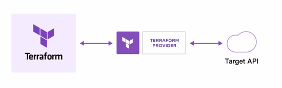
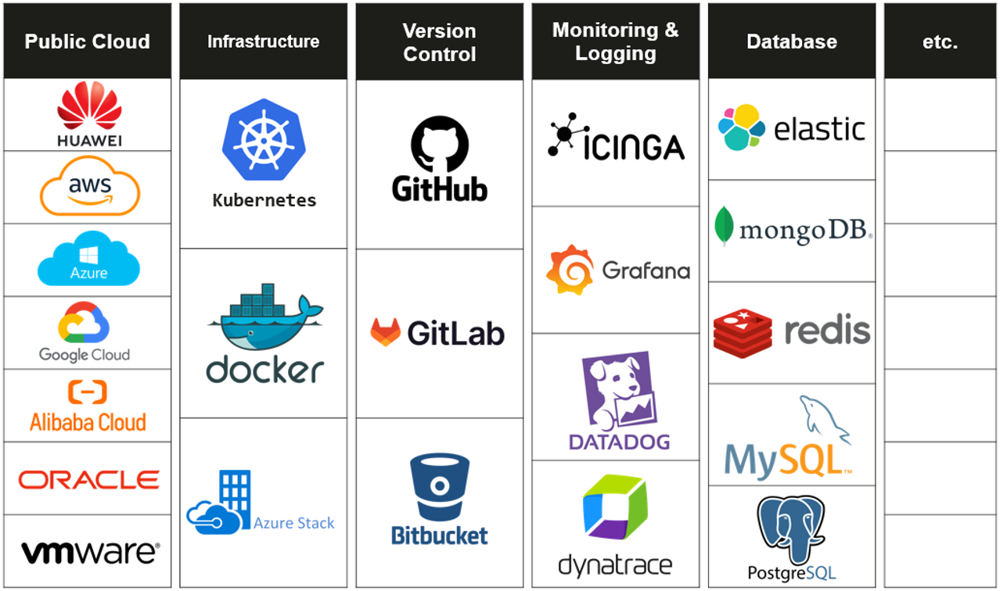
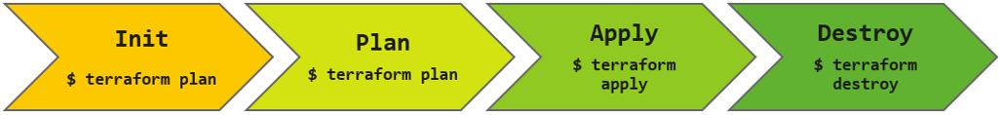
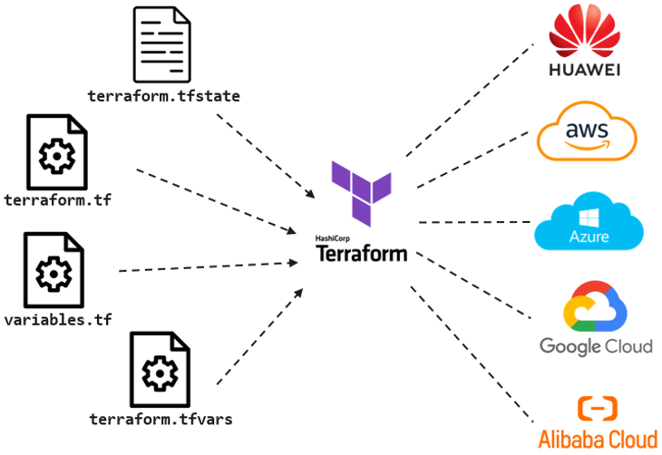

# Building a Solid Understanding for Effective Hands-on Learning

### Infrastructure as Code (IaC) Concept

The traditional way of infrastructure provisioning was typically using web interfaces or command line tools to create resources which is often **error-prone**, **inconsistencies across different environments** and **high risk in configuration drift**. 

**Infrastructure as Code** was introduced to address the limitation on traditional approach by enabling the infrastructure to be defined, managed and version-controlled through code. It involves using programming languages or **declarative configuration files** to define and automate the infrastructure resource required. With the use of IaC, the infrastructure configuration become **human-readables**, **shareable**, and **reusable**, providing more efficient and consistent way to manage infrastructure resources across multiple environments.

The typical example of Infrastructure as Code (IaC) tools includes AWS CloudFormation, Red Hat Ansible, Chef, Puppet, SaltStack and **HashiCorp Terraform**. Terraform will be used as the IaC tool throughout this hands-on learning.



*<p align="center"> Figure 1.0: Infrastructure as Code (IaC) Overview </p>*

### What is Terraform

[Terraform](https://developer.hashicorp.com/terraform/intro) is an open-source Infrastructure as Code (IaC) tool developed by HashiCorp where it allows you to define, provision, and manage infrastructure resources across various **cloud providers**, **on-premises systems**, and other **infrastructure platforms**. Terraform can be used to describe the desired infrastructure configuration in terms of compute, network, storage, and other components.

*<p align="center">  </p>*

*<p align="center"> Figure 1.1: How does Terraform works? </p>*

Above diagram shows the working principle of Terraform where it takes the configuration code and interacts with the APIs of the target infrastructure providers to create, update and destroy resources according to the desired configurations.

### Terraform Provider

Terraform was formed by a huge community where they are vibrant, active and have a strong focus on developing and maintaining provider plugins for various infrastructure platforms and services. They play a crucial role in expanding the ecosystem of Terraform providers and supporting the development in terms of **public cloud** (Azure, AWS, GCP, Huawei Cloud, AliCloud, Oracle, etc.), **infrastructure services** (Kubernetes, Docker, AzureStack, etc.), **version control system** (GitHub, GitLab, BitBucket, etc.), **monitoring and logging platform** (Grafana, DataDog, Dynatrace, etc.), **database** (ElasticStack, MongoDB, MySQL, RedisCloud, etc.), and etc.

*<p align="center">  </p>*

*<p align="center"> Figure 1.2: Terraform Providers Community </p>*

### Terraform Lifecycle

The diagram below shows the terraform lifecycle which includes the process of **init**, **plan**, **apply** and **destroy**.

*<p align="center">  </p>*

*<p align="center"> Figure 1.3: Terraform lifecycle </p>*

The table below describes the usage of typical Terraform commands.

| Terraform Command | Usage |
| ------------- | ------------- |
| ```terraform init``` | To initialize the local Terraform environment and install any plugins as needed |
| ```terraform plan``` | Compares the Terraform state with the current state in the cloud and displays the execution plan for changes review |
| ```terraform apply``` | Execute the plan and make changes to the environment while updating the state file |
| ```terraform destroy``` | Destroy the resources when it is no longer needed |

### Terraform Basic Concept

* **variables**: Terraform variable allow you to parameterize your configurations. They act as a placeholders for values that can be defined when using Terraform modules or configurations, provides flexibility and reusability by allowing you to change values without modifying your code <br>
* **module**: A reusable and encapsulated set of configurations, allow you to organize and abstract your infrastructure code into smaller, manageable components. Module can be used to create reusable infrastructure building blocks <br>
* **state**: Terraform maintain the a state file that keeps track of the current state of your infrastructure. It stores information about the resources you've created, their attributes, and their relationships. <br>
* **resources**: Resources are the core building blocks of your infrastructure in Terraform. They represent the various cloud or on-premises components you want to create and manage, such as virtual machines, databases, networks or security groups. <br>
* **data sources**: Allow you to retrieve information from existing infrastructure or external sources. They provide read-only access to the data that you can use within your configurations. For example, you can use the data source to fetch information about an existing storage bucket. <br>
* **plan**: A Terraform plan is the result of running ```terraform plan```. The result output a detailed execution plan that shows what Terraform will do when you apply your configurations. It helps you preview changes before they are applied, ensuring your understand the impact of your changes. <br>
* **apply**: The ```terraform apply``` command is used to execute the changes defined in your Terraform configurations. It creates, updates, or deletes resources according to the desired state you've defined. Applying your Terraform code makes the infrastructure changes efective.

### Terraform Configuration Files

Terraform configuration file was written in **HashiCorp Configuration Language (HCL)** that defines infrastructure resources and their configuration that you want to provision and manage using Terraform. It is made up of one or more files in a directory, provider binaries, plan files, and state files once Terraform has run the configuration. The Terraform configuration files having an extension of **.tf** and **.tfvars**.

*<p align="center">  </p>*

*<p align="center"> Figure 1.4: Terraform Configuration Files </p>*

* **configuration files**: with an extension of **.tf** and used to declare providers and defines the resource behaviors that are going to apply to different environment <br>
* **variable declaration file**: such as **variables.tf** that used to declare the input variables required to provision resources <br>
* **variable definition files**: with an extension of **.tfvars** and used to assign value to input variables <br>
* **state file**: with an extension of **.tfstate** and is created once Terraform is run where it records the latest state of the managed infrastructure

### Terraform Installation

The official guidelines in [Terraform](https://developer.hashicorp.com/terraform/tutorials/aws-get-started/install-cli) website provides you a clear instructions on how to install the Terraform on your local machine with the selection of appropriate operating system.