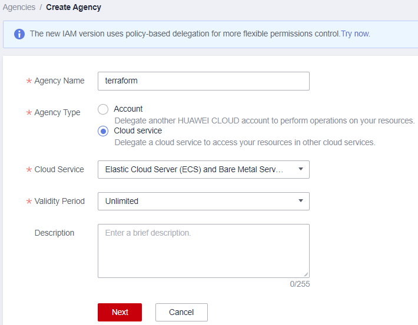

# Getting Started to Hands-on Learning with Terraform 101

There are different ways in executing the Terraform commands, the most easiest way is to run Terraform on your local machine and store the state file locally. This requires the Huawei Cloud account **access key** and **secret key** with programmatic access permission in order to provision cloud resources. However, the use of access and secret key in Terraform **poses a security risk** if someone accidentally obtain the access to your code development, he or she might potentially misuse these credentials and modify your infrastructure environments.

Thus, to minimize the risk mentioned and avoid the running of Terraform with the use of access and the secret key, you are required to have [a running ECS instance with Agency configured](https://registry.terraform.io/providers/huaweicloud/huaweicloud/latest/docs). With the agency, Terraform will only ask the **metadata API for credentials** where this is a preferred approach over any other when running in ECS as you can avoid hard-coding credentials. Instead, these are leased on-the-fly by Terraform which reduces the chance of leakage.

In this hands-on lab learning, we will provision an [Elastic Cloud Server (ECS)](https://support.huaweicloud.com/intl/en-us/productdesc-ecs/en-us_topic_0013771112.html) on Huawei Cloud for the use of running the Terraform commands.

### Preparing the Terraform Environment

You may follow the instructions below to provision an ECS and configure the agency and Terraform on Huawei Cloud environment.

1. Log in to the [Huawei Cloud](https://auth.huaweicloud.com/authui/login.html?locale=en-us&service=https%3A%2F%2Fwww.huaweicloud.com%2Fintl%2Fen-us%2F#/login) account with the credentials configured or provided by your administrator. Navigate to the Identity and Access Management (IAM) console and select agencies. Insert the information below, you may modify the agency name according to your preferences.

    *<p align="center">  </p>*

    *<p align="center"> Figure 2.0: Create a new Agency </p>*

2. Assign a **“FullAccess”** permission to the agency. Click ```submit``` button to complete the agency creation. <br> (**Notes:** “FullAccess” permission granting complete access rights to the ECS on cloud resources. In a real production environment, you should always follow the principle of least privilege by granting the minimum required permission to limit access to critical resources and sensitive operations.)
    
    *<p align="center">  </p>*

    *<p align="center"> Figure 2.1: Assign permission to the agency </p>*

3. Navigate to the ECS console and create an ECS with the following specifications.

    **region**          : Singapore Region <br>
    **operating system**: Ubuntu 22.04 <br>
    **compute flavor**  : s6.large.2 <br>
    **vCPUs**           : 2 <br>
    **memory**          : 4GiB <br>
    **system disk**     : High I/O 40GB <br>
    **eip**             : 50 Mbit/s

    *<p align="center">  </p>*

    *<p align="center"> Figure 2.2: Create an ECS in Huawei Cloud </p>*

4. Once the ECS is up and running, log in to the ECS and install the Terraform with the command below. <br> (**Notes:** If you are using different operating system other than Ubuntu, please follow the guidelines in [Terraform](https://developer.hashicorp.com/terraform/tutorials/aws-get-started/install-cli) website instead.)

    ```$ sudo apt update``` <br>
    ```$ sudo apt install software-properties-common gnupg2 curl``` <br>
    ```$ curl https://apt.releases.hashicorp.com/gpg | gpg --dearmor > hashicorp.gpg``` <br>
    ```$ sudo install -o root -g root -m 644 hashicorp.gpg /etc/apt/trusted.gpg.d/``` <br>
    ```$ sudo apt-add-repository "deb [arch=$(dpkg --print-architecture)] https://apt.releases.hashicorp.com $(lsb_release -cs) main"``` <br>
    ```$ sudo apt install terraform``` <br>
    ```$ terraform --version``` <br>

5. Once the Terraform is successfully installed, navigate to the ECS console and bind the agency created in **Step 1** to the ECS.

    *<p align="center">  </p>*

    *<p align="center"> Figure 2.3: Bind agency to ECS </p>*


### Obtain the Terraform source code template

1. Login to the ECS created in  [Step 3](https://github.com/Huawei-APAC-Professional-Services/terraform-101-workshop/blob/master/workshop/01_Getting_Started.md) under previous section, and run the below command to clone the Terraform template from GitHub.

    ```git clone https://github.com/Huawei-APAC-Professional-Services/terraform-101-workshop.git```

    Below describe the usage of the folder directory in the Terraform template that have been cloned. 

    * **hwcloud-terraform**: project directory <br>
    * **resource-provisioning-playbook**: project directory to create module block for resource provisioning <br>
    * **terraform-hwcloud-modules**: directory to store all the reusable configuration scripts for different resources

2. There are two different ways to **edit the Terraform Configuration Scripts** as described below.

    a. Using [Visual Studio Code](https://code.visualstudio.com/download) Editor <br>

       You may clone the Terraform Configuration Template in Step 1 to your local machine and edit the code using Visual Studio Code Editor. Once you have done editing, you can use [WinSCP](https://winscp.net/eng/download.php) Tool to transfer the files from local machine to the remote host as below. <br>
       (**Notes**: Ensure your ECS instance have the [Security Group](https://support.huaweicloud.com/intl/en-us/usermanual-vpc/en-us_topic_0073379079.html) with open port number 22)

      *<p align="center">  </p>*

      *<p align="center"> Figure 2.4: Transfer files using WinSCP tool </p>*