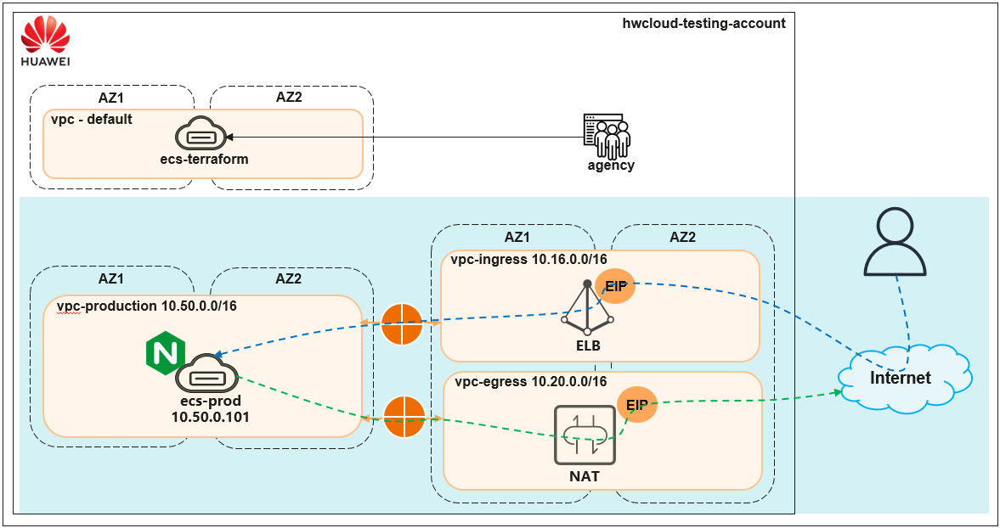

# Overall Architecture Diagram

This section provides you with a very quick introduction to the overall cloud architecture that will be provisioned (blue color portion in below diagram) in this hands-on lab learning which includes the network, storage and compute cloud resource.

### Solution Overview

*
  
*

*
 Figure 3.0: Overall Cloud Architecture Diagram 
*

There will be three Virtual Private Cloud (VPCs) to be deployed in the Hong Kong region (ap-southeast-1) to serve different purposes as stated below:

* **transit VPCs** to control the ingress traffic (vpc-ingress) and egress traffic (vpc-egress) within the cloud environment or between the cloud environment and the outside world. 
* A **NAT Gateway** will be deployed in the **egress VPC** to allow the workloads in other isolated environments (other VPCs) to be able to access the internet.
* An **Eastic Load Balancer (ELB)** will be deployed in the **ingress VPC** to allow the workloads in other isolated environments (other VPCs) to be accessed from the internet via the public IPs.
* All the workloads such as **applications and databases** will be placed in the **production VPC** (vpc-production). This VPC is peers to the transit VPC (vpc-ingress and vpc-egress) so that the traffic can be routed to the NAT gateway to allow internet access and the workloads can be accessed from the internet via the ELB.