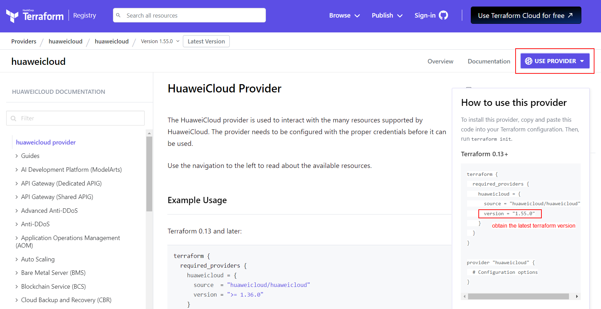

# Building Your Infrastructure from Code with Terraform Scripting

In this guideline, you will learned how to configure the Terraform configuration scripts using the **modular structure** in order to provision the resource to achieve the architecture as in [Figure 3.0](https://github.com/Huawei-APAC-Professional-Services/terraform-101-workshop/blob/master/workshop/02_Solution_Overview.md).

### Configure Terraform Scripts

Under this section, you will be guided step-by-step on how to provision **multiple network resources** on the Huawei Cloud environment. Follow the steps below for resource provisioning.

1. Under the ```hwcloud-terraform/resource-provisioning-playbook/provider.tf``` configuration file, configure the provider to be used in the resource provisioning. Modify the terraform provider ```version``` within the ```terraform block``` to the latest version, you may refer to this [Huawei Cloud Terraform](https://registry.terraform.io/providers/huaweicloud/huaweicloud/latest/docs) website for the latest version of the provider to be used. <br>

    ```
    terraform {
      required_providers {
        huaweicloud = {
          source  = "huaweicloud/huaweicloud"
          version = "1.56.0"
        }
      }
    }
    provider "huaweicloud" {
      region     = "ap-southeast-1"
    }
    ```
    *<p align="center">  </p>*
    *<p align="center"> Figure 4.0: Terraform Provider Version </p>*

2. Under the ```hwcloud-terraform/resource-provisioning-playbook/``` directory, create a new terraform file and named it as ```vpc.tf```. Within the vpc.tf file, we will create multiple module blocks for all the VPCs requires according to the diagram in [Figure 3.0](https://github.com/hwcloud-apac-pso/terraform-101-workshop/blob/main/workshop/02_Solution_Overview.md).

  #### 2.1 Create egress VPC

  The **egress VPC** will accomodate the [NAT Gateway](https://support.huaweicloud.com/intl/en-us/productdesc-natgateway/en-us_topic_0086739762.html) for the egress traffic purpose which allow the workloads have the internet access via the SNAT rule configured in NAT Gateway. By referring to the Terraform template downloaded, navigate to the ```hwcloud-terraform/terraform-hwcloud-modules/terraform-hwcloud-vpc```, there are reusable configuration scripts where the usage is described as below.

  * **main.tf**: reusable resources configuration block for VPCs, subnets, NAT Gateway, EIP, and ELB resources <br>
  * **version.tf**: terraform provider version configuration <br>
  * **variables.tf**: input variables used in main.tf to define resource behaviors <br>
  * **outputs.tf**: output variables to display or record the resource ID in terraform state file

    a. Prior to create the egress VPC and NAT gateway using the modular structure and reusable scripts as mentioned above, you need to specify the soure of the reusable configuration scripts within the module block as below before you can use the variables defined. <br>
    (**Notes**: Modify the source path accordingly if you have different project directory, you may modify the module name based on your preferences.)

      ```
      module "transit-vpc-egress" {
        source = "../terraform-hwcloud-modules/terraform-hwcloud-vpc"
      }
      ```

    b. Next is to insert the input variables from the reusable configuration scripts that requires to create the egress VPC and NAT resource. You may obtain the input variables from ```hwcloud-terraform/terraform-hwcloud-modules/terraform-hwcloud-vpc/variables.tf``` configuration file such as ```name```, ```vpc_cidr```, ```egress_subnet_name```, ```egress_subnet_cidr```, ```egress_nat_gw_name```, and ```nat_eip_name``` to be inserted within the module block.

      ```
      module "transit-vpc-egress" {
        source = "../terraform-hwcloud-modules/terraform-hwcloud-vpc"
        name =
        vpc_cidr =
        egress_subnet_name =
        egress_subnet_cidr =
        egress_nat_gw_name =
        nat_eip_name =
      }
      ```

    c. The values for each input variable is used to describe the resource behaviors. To ease the changes of resource behaviors in the future, you should define the values using the variable block instead. The example variable value definition for egress VPC is as below.

      ```
      module "transit-vpc-egress" {
        source = "../terraform-hwcloud-modules/terraform-hwcloud-vpc"
        name = var.transit_egress_vpc
        vpc_cidr = var.transit_egress_vpc_cidr
        egress_subnet_name = var.transit_egress_subnet_name
        egress_subnet_cidr = var.transit_egress_subnet_cidr
        egress_nat_gw_name = var.transit_egress_nat_gw_name
        nat_eip_name = var.transit_egress_nat_eip_name
      }
      ```

    d. Under the ```hwcloud-terraform/resource-provisioning-playbook/``` directory, create a new terraform file and named it as ```input_local_vars.tf```. This terraform file will stored the values defined in previous step by using the variable blocks. Example scripts is as below, the variable name should follow the name you defined in Step c and you may modify the assign value accordingly. <br>

      ```
      variable "transit_egress_vpc" { default = "vpc-egress" }
      variable "transit_egress_vpc_cidr" { default = "10.20.0.0/16" }
      variable "transit_egress_subnet_name" { default= "vpc-egress-sub" }
      variable "transit_egress_subnet_cidr" { default= "10.20.0.0/24" }
      variable "transit_egress_nat_gw_name" { default=  "nat-prod" }
      variable "transit_egress_nat_eip_name" { default=  "nat-prod-eip" }
      ```

    e. In order to obtain the created resource ID, create a new terraform file and named it as ```outputs.tf``` under ```hwcloud-terraform/resource-provisioning-playbook/``` directory. Within the file, create the output block to display and store the created resource ID in terraform state file. Example scripts is as below, you may modify the output variable name accordingly.

      ```
      output "egress_vpc_id" { value = }
      output "egress_subnet_id" { value =  }
      output "egress_natgw_id" { value =  }
      ```

    f. The **output variable values** should obtain from the reusable configuration scripts under ```hwcloud-terraform/terraform-hwcloud-modules/terraform-hwcloud-vpc/outputs.tf``` file. For example the ```vpc_id```, ```egress_subnet_id```, and ```egress_nat_gw_id``` and the format is as below:

    **output "output-variable-name" { value = module.module-name.output-variable-name-from-reusable-configuration-scripts}**

      ```
      output "egress_vpc_id" { value = module.transit-vpc-egress.vpc_id}
      output "egress_subnet_id" { value = module.transit-vpc-egress.egress_subnet_id }
      output "egress_natgw_id" { value = module.transit-vpc-egress.egress_nat_gw_id }
      ```

  #### 2.2 Create ingress VPC

  The **ingress VPC** will accomodate the [Elastic Load Balancer (ELB)](https://support.huaweicloud.com/intl/en-us/productdesc-elb/en-us_topic_0015479966.html) for the ingress traffic purpose which allow the applications within the Huawei Cloud environment to be accessible from the internet.
  
  a. Within the same ```vpc.tf``` file created earlier under ```hwcloud-terraform/resource-provisioning-playbook/``` directory, configure another module block to provision ingress VPC. Specify the **source path** to obtain the configuration scripts. <br>
  (**Notes**: Modify the source path accordingly if you have different project directory, you may modify the module name based on your preferences.)

  ```
  module "transit-vpc-ingress" {
    source = "../terraform-hwcloud-modules/terraform-hwcloud-vpc"
  }
  ```

  b. Next is to insert the input variables from the reusable configuration scripts that requires to create the ingress VPC and ELB resource. You may obtain the input variables from ```hwcloud-terraform/terraform-hwcloud-modules/terraform-hwcloud-vpc/variables.tf``` configuration file such as ```name```, ```vpc_cidr```, ```ingress_subnet_name```, ```ingress_subnet_cidr```, ```ingress_elb_name```, and ```elb_az``` to be inserted within the module block.

  ```
  module "transit-vpc-ingress" {
    source = "../terraform-hwcloud-modules/terraform-hwcloud-vpc"
    name =
    vpc_cidr =
    ingress_subnet_name =
    ingress_subnet_cidr =
    ingress_elb_name =
    elb_az =
  }
  ```

  c. The values for each input variable is used to describe the resource behaviors. To ease the changes of resource behaviors in the future, you should define the values using the variable block instead. The example variable value definition for ingress VPC is as below.

  ```
  module "transit-vpc-ingress" {
    source = "../terraform-hwcloud-modules/terraform-hwcloud-vpc"
    name = var.transit_ingress_vpc
    vpc_cidr = var.transit_ingress_vpc_cidr
    ingress_subnet_name = var.transit_ingress_subnet_name
    ingress_subnet_cidr = var.transit_ingress_subnet_cidr
    ingress_elb_name = var.transit_ingress_elb_name
    elb_az = var.transit_ingress_elb_az
  }
  ```

  d. Navigate to the ```hwcloud-terraform/resource-provisioning-playbook/input_local_vars.tf``` file created in Section 2.1, declare the variable values that you had defined in previous step. Example scripts is as below, the variable name should follow the name you had defined in previous step and you may modify the assign value accordingly. <br>

  ```
  variable "transit_ingress_vpc" { default = "vpc-ingress" }
  variable "transit_ingress_vpc_cidr" { default = "10.16.0.0/16" }
  variable "transit_ingress_subnet_name" { default = "vpc-ingress-sub" }
  variable "transit_ingress_subnet_cidr" { default = "10.16.0.0/24" }
  variable "transit_ingress_elb_name" { default = "elb-prod" }
  variable "transit_ingress_elb_az" { default = [ "ap-southeast-3a","ap-southeast-3b"] }
  ```

  e. Navigate to the ```hwcloud-terraform/resource-provisioning-playbook/outputs.tf``` file created in Section 2.1, configure another output block to display and store the created ingress resource ID in terraform state file. Example scripts is as below, you may modify the output variable name accordingly.

  ```
  output "ingress_vpc_id" { value = }
  output "ingress_subnet_id" { value = }
  ```

  f. The **output variable values** should obtain from the reusable configuration scripts under ```hwcloud-terraform/terraform-hwcloud-modules/terraform-hwcloud-vpc/outputs.tf``` file. For example the ```vpc_id```, ```ingress_subnet_id``` and ```ingress_elb_id```, and the format is as below.

  **output "output-variable-name" { value = module.module-name.output-variable-name-from-reusable-configuration-scripts}**

  ```
  output "ingress_vpc_id" { value = module.transit-vpc-ingress.vpc_id}
  output "ingress_subnet_id" { value = module.transit-vpc-ingress.ingress_subnet_id }
  output "ingress_elb_id" { value = module.transit-vpc-ingress.ingress_elb_id }
  ```

  #### 2.3 Create production VPC

  The **production VPC** will accomodate the [Elastic Cloud Server (ECS)](https://support.huaweicloud.com/intl/en-us/productdesc-ecs/en-us_topic_0013771112.html) or any workloads where the applications is installed and the database is configured.

  a. Within the same ```vpc.tf``` file created earlier under ```hwcloud-terraform/resource-provisioning-playbook/``` directory, configure another module block to provision production VPC. Specify the **source path** to obtain the configuration scripts. <br>
  (**Notes**: Modify the source path accordingly if you have different project directory, you may modify the module name based on your preferences.)

  ```
  module "prod-vpc" {
    source = "../terraform-hwcloud-modules/terraform-hwcloud-vpc"
  }
  ```

  b. Next is to insert the input variables from the reusable configuration scripts that requires to create the production VPC resource. You may obtain the input variables from ```hwcloud-terraform/terraform-hwcloud-modules/terraform-hwcloud-vpc/variables.tf``` configuration file such as ```name```, ```vpc_cidr```, ```private_subnet_name```, and ```private_subnet_cidr``` to be inserted within the module block.

  ```
  module "prod-vpc" {
    source = "../terraform-hwcloud-modules/terraform-hwcloud-vpc"
    name =
    vpc_cidr =
    private_subnet_name =
    private_subnet_cidr =
  }
  ```

  c. The values for each input variable is used to describe the resource behaviors. To ease the changes of resource behaviors in the future, you should define the values using the variable block instead. The example variable value definition for ingress VPC is as below.

  ```
  module "prod-vpc" {
    source = "../terraform-hwcloud-modules/terraform-hwcloud-vpc"
    name = var.prod_vpc
    vpc_cidr = var.prod_vpc_cidr
    private_subnet_name = var.prod_private_subnet_name
    private_subnet_cidr = var.prod_private_subnet_cidr
  }
  ```

  d. Navigate to the ```hwcloud-terraform/resource-provisioning-playbook/input_local_vars.tf``` file created in Section 2.1, declare the variable values that you had defined in previous step. Example scripts is as below, the variable name should follow the name you had defined in previous step and you may modify the assign value accordingly. <br>

  ```
  variable "prod_vpc" { default = "vpc-prod" }
  variable "prod_vpc_cidr" { default = "10.100.0.0/16" }
  variable "prod_private_subnet_name" { default = "vpc-prod-sub" }
  variable "prod_private_subnet_cidr" { default = "10.100.0.0/24" }
  ```

  e. Navigate to the ```hwcloud-terraform/resource-provisioning-playbook/outputs.tf``` file created in Section 2.1, configure another output block to display and store the created production resource ID in terraform state file. Example scripts is as below, you may modify the output variable name accordingly.

  ```
  output "prod_vpc_id" { value = }
  output "prod_subnet_id" { value = }
  ```

  f. The **output variable values** should obtain from the reusable configuration scripts under ```hwcloud-terraform/terraform-hwcloud-modules/terraform-hwcloud-vpc/outputs.tf``` file. For example the ```vpc_id``` and ```private_subnet_id```, and the format is as below.

  **output "output-variable-name" { value = module.module-name.output-variable-name-from-reusable-configuration-scripts}**

  ```
  output "prod_vpc_id" { value = module.prod-vpc.vpc_id}
  output "prod_subnet_id" { value = module.prod-vpc.private_subnet_id }
  ```

### Execute the Terraform commands for network resource creations

At this stage, you have completed the configuration scripts for the VPCs, NAT Gateway and ELB resources. Follow the instructions below to upload the source code to the ECS and provision the network resources on Huawei Cloud environment. 

1. Upload the source code to the ECS on Huawei Cloud environment.

  a. **Using Command Line (CLI)**, enter the ECS credentials as prompted, the default value is **Huawei@123**.
  * **Linux** <br>
  ```scp /path-to-project-directory/hwcloud-terraform/resource-provisioning-playbook/input_local_vars.tf root@public-ip-address-of-the-ecs:~/hwcloud-terraform/resource-provisioning-playbook/``` <br>
  ```scp /path-to-project-directory/hwcloud-terraform/resource-provisioning-playbook/outputs.tf root@public-ip-address-of-the-ecs:~/hwcloud-terraform/resource-provisioning-playbook/``` <br>
  ```scp /path-to-project-directory/hwcloud-terraform/resource-provisioning-playbook/vpc.tf root@public-ip-address-of-the-ecs:~/hwcloud-terraform/resource-provisioning-playbook/``` <br> 

  * **Windows** <br>
  ```scp \path-to-project-directory\hwcloud-terraform\resource-provisioning-playbook\input_local_vars.tf root@public-ip-address-of-the-ecs:~/hwcloud-terraform/resource-provisioning-playbook/``` <br>
  ```  scp \path-to-project-directory\hwcloud-terraform\resource-provisioning-playbook\outputs.tf root@public-ip-address-of-the-ecs:~/hwcloud-terraform/resource-provisioning-playbook/``` <br>
  ```  scp \path-to-project-directory\hwcloud-terraform\resource-provisioning-playbook\vpc.tf root@public-ip-address-of-the-ecs:~/hwcloud-terraform/resource-provisioning-playbook/``` <br>

  b. **Using WinSCP Tool**: Locate your files on your local machine, and manually copy and paste the files to the remote host.

2. Login to the ECS with Terraform installed, check if all the files has been uplaoded successfully. Navigate to the ```hwcloud-terraform/resource-provisioning-playbook/``` directory and run the below commands to **format** the terraform configuration files to ensure a consistent format within codebase and **initialize the modules** being used for resource provisioning. <br>

    ```cd hwcloud-terraform/resource-provisioning-playbook/``` <br>
    ```terraform fmt```<br>
    ```terraform init```

3. Once sucessfully initialize the configuration scripts, execute the below commands to **validate** the configuration scripts and output the configuration plan that are going to apply to the Huawei Cloud environment. **This command will only review the plan without making any changes to your environment**. <br>

    ```terraform validate```<br>
    ```terraform plan```

4. Once review the plan, execute the commands below to **apply changes** to your environment. <br>

    ```terraform apply -auto-approve```

5. Repeat **Step 1** only if you have added any new module blocks. Repeat **Step 2** and **Step 3** if you have modified the scripts for troubleshooting purpose.