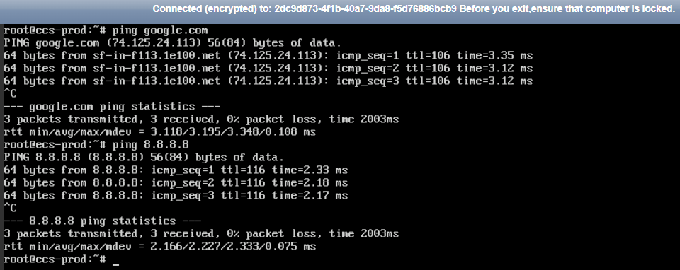
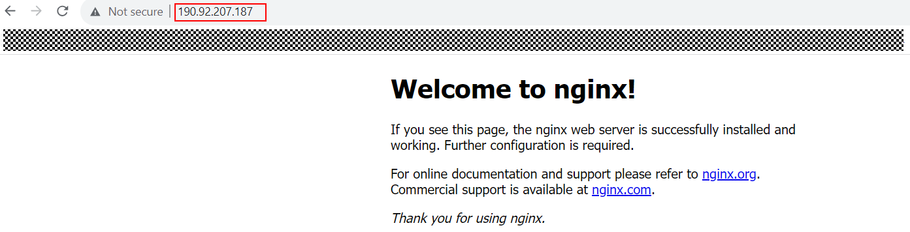

# Result Validation for Terraform Hands-on Exercise

At this stage, you have successfully built your infrastructure environment, the next step is you should always perform **System Validation Testing (SVT)** to validate the functionality of the resources that you have created. 

### Configure an ECS in production VPC for SVT

To validate the functionality of the resources being created, you need to have an **Elastic Cloud Server (ECS) in your production environment** to perform network connection testing. Follow the instruction below to create an ECS in production VPC using terraform scripts.

1. From the downloaded template, you should have obtain the ECS configuration template named as ```ecs.tf``` file under ```hwcloud-terraform/resource-provisioning-playbook``` directory. Within the ```ecs.tf``` file, uncomment all the lines (enter ```esc``` on the keyboard and type command ```:%s/^\s*#\s*//```), locate the ```huaweicloud_compute_instance``` resource block and modify the resource arguments as below. This step is to create an ECS instance with the specific IP address within the production subnet CIDR range.

    * **uuid**: replace the module name with your configured production VPC module name
    * **fixed_ip_v4**: change the private IP address of the ECS according to the your production subnet CIDR range
    * **depends_on**: replace the module name with your configured production VPC module name <br>

    ```
    resource "huaweicloud_compute_instance" "ecs" {

        ... 

        network {
            uuid = module.prod-vpc.private_subnet_id
            fixed_ip_v4  = "10.50.0.101"
        }
        depends_on = [ 
            module.prod-vpc
        ]
    } 
    ```

2. Within the same ```ecs.tf``` file, locate the ```huaweicloud_elb_listener``` resource block and modify the resource arguments as below. This step is to add the ELB listener and configure the production server as the backend server of the ELB, so that the traffic coming from the internet will be forwarded to the backend server by listening to the specific port number.

    * **loadbalancer_id**: replace the module name with your configured ingress VPC module name <br>
    
    ```
    resource "huaweicloud_elb_listener" "ingress_elb_listener" {

        ...

        loadbalancer_id = module.transit-vpc-ingress.ingress_elb_id
    }
    ```

3. Within the same ```ecs.tf``` file, locate the ```huaweicloud_vpc_route``` resource block and modify the resource arguments as below. This step is to create a default route (0.0.0.0/0) in the production VPC route table where the nexthop is pointing to the VCC Peering connection, so that any egress traffic will be forwarded to the NAT Gateway and go outside internet via the EIP boound.

    * **vpc_id**: replace the module name with your configured production VPC module name
    * **nexthop**: replace the module name with your configured VPC Peering module name for connection in between production and egress VPCs <br>
    
    ```
    resource "huaweicloud_vpc_route" "vpc_route" { 

        ...

        vpc_id   = module.prod-vpc.vpc_id
        nexthop  = module.prod_vpc_2_transit_egress_vpc.requester_vpc_peering_id
    }
    ```

4. Within the same ```ecs.tf``` file, locate the ```huaweicloud_nat_snat_rule``` resource block and modify the resource arguments as below. This step is to add an SNAT rule in the NAT Gateway where the destination is the production VPC CIDR range, so that the egress traffic from the production workloads can reach to the internet.

    * **nat_gateway_id**: replace the module name with your configured egress VPC module name
    * **floating_ip_id**: replace the module name with your configured egress VPC module name <br>
    
    ```
    resource "huaweicloud_nat_snat_rule" "egress_snat_rule_for_prod" {

        ...

        nat_gateway_id = module.transit-vpc-egress.egress_nat_gw_id
        floating_ip_id = module.transit-vpc-egress.egress_nat_gw_eip
    }
    ```

5. The ```user_data.sh``` scripts provided under ```hwcloud-terraform/resource-provisioning-playbook``` directory contains the user data that will be injected during the ECS creation and initialization. It includes the initialize of ECS password and install a simple [Nginx](https://www.nginx.com/) web application for SVT purpose. **Do not modify this file**.

    ```
    #!/bin/bash
    echo `date` > /tmp/user_data.txt
    #echo "Huawei@123" | passwd --stdin root
    echo "root:candidate@2024" | sudo chpasswd
    sudo apt update -y &&
    sudo apt install -y nginx
    ```

### Execute the Terraform commands for compute resource creations

At this stage, you have modified the configuration scripts for the ECS resource. Now you are required to execute the terraform command for resource provisioning, select the appropriate method below to execute the task.

#### Method 1 ####
This method is applicable if you are using Huawei ECS to write and modify the Terraform scripts. Follow the instruction below to create ECS resources.

1. Under the ```hwcloud-terraform/resource-provisioning-playbook/``` directory, run the below commands to **format** the terraform configuration files to ensure a consistent format within codebase and **initialize the modules** being used for resource provisioning. <br>

    ```cd hwcloud-terraform/resource-provisioning-playbook/``` <br>
    ```terraform fmt```<br>
    ```terraform init```

2. Once sucessfully initialize the configuration scripts, execute the below commands to **validate** the configuration scripts and output the configuration plan that are going to apply to the Huawei Cloud environment. **This command will only review the plan without making any changes to your environment**. <br>

    ```terraform validate```<br>
    ```terraform plan```

3. Once review the plan, execute the commands below to **apply changes** to your environment. <br>

    ```terraform apply -auto-approve```

4. Repeat **Step 1** only if you have added any new module blocks. Repeat **Step 2** and **Step 3** if you have modified the scripts for troubleshooting purpose.

#### Method 2 ####
This method is applicable if you are using your local machine to write and modify the Terraform scripts. Follow the instructions below to upload the source code to the ECS and provision the ECS resources on Huawei Cloud environment. 

1. Upload the source code to the ECS on Huawei Cloud environment.

    a. **Using Command Line (CLI)**, enter the ECS credentials as prompted, the default value is **Huawei@123**.
    * **Linux** <br>
      ```
      $ scp /path-to-project-directory/hwcloud-terraform/resource-provisioning-playbook/ecs.tf root@public-ip-address-of-the-ecs:~/hwcloud-terraform/resource-provisioning-playbook/
      ```

    * **Windows** <br>
      ```
      $ scp \path-to-project-directory\hwcloud-terraform\resource-provisioning-playbook\ecs.tf root@public-ip-address-of-the-ecs:~/hwcloud-terraform/resource-provisioning-playbook/
      ```

    b. **Using WinSCP Tool**: Locate your files on your local machine, and manually copy and paste the files to the remote host.

2. Login to the ECS with Terraform installed, navigate to the ```hwcloud-terraform/resource-provisioning-playbook/``` directory and run the below commands to **format** the terraform configuration files to ensure a consistent format within codebase and **initialize the modules** being used for resource provisioning. <br>

    ```cd hwcloud-terraform/resource-provisioning-playbook/``` <br>
    ```terraform fmt```<br>
    ```terraform init```

3. Once sucessfully initialize the configuration scripts, execute the below commands to **validate** the configuration scripts and output the configuration plan that are going to apply to the Huawei Cloud environment. **This command will only review the plan without making any changes to your environment**. <br>

    ```terraform validate```<br>
    ```terraform plan```

4. Once review the plan, execute the commands below to **apply changes** to your environment. <br>

    ```terraform apply -auto-approve```

5. Repeat **Step 1** only if you have added any new module blocks. Repeat **Step 2** and **Step 3** if you have modified the scripts for troubleshooting purpose.

### Performs System Validation Testing

At this stage, the ECS resource is successfully created. Follow the instructions below to perform the system validation testing to test the ingress and egress traffic of the production worklaods.

1. Log in to the ECS, and perform a simple ping test as below. If you get the similar result as below, it means the egress traffic is working fine.<br>
    ```ping google.com``` <br>
    ```ping 8.8.8.8```

    

    *<p align="center"> Figure 5.0: Able to access to the internet from production ECS </p>*

2. Navigate to the ELB console, copy the ELB EIP, and paste it to any web browser. You should see the Nginx web page shown on your browser as below. If you get the similar result as below, it means the ingress traffic is working fine. <br>

    

    *<p align="center"> Figure 5.1: Access Nginx using ELB EIP address </p>*